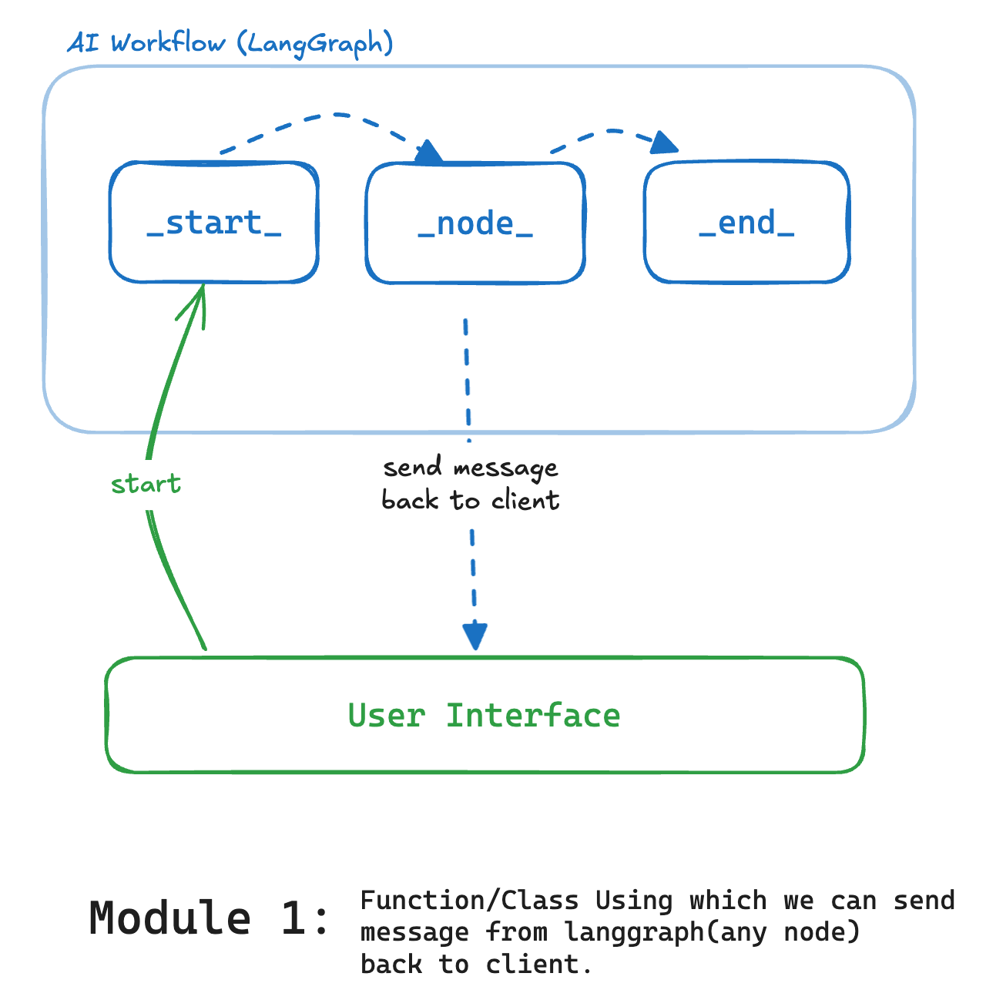
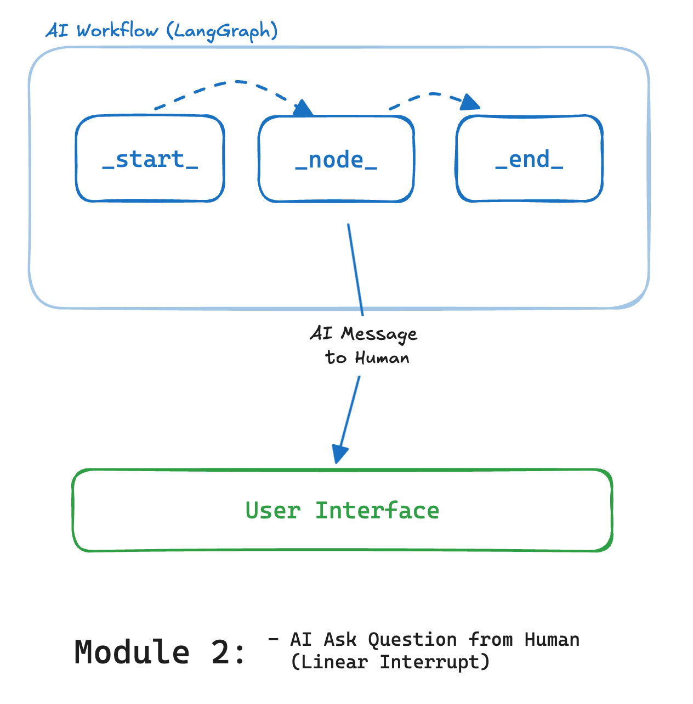
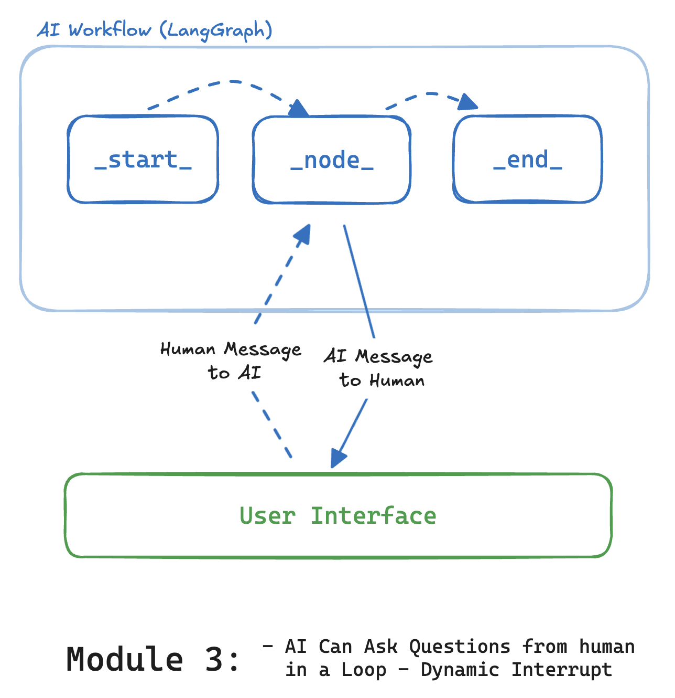
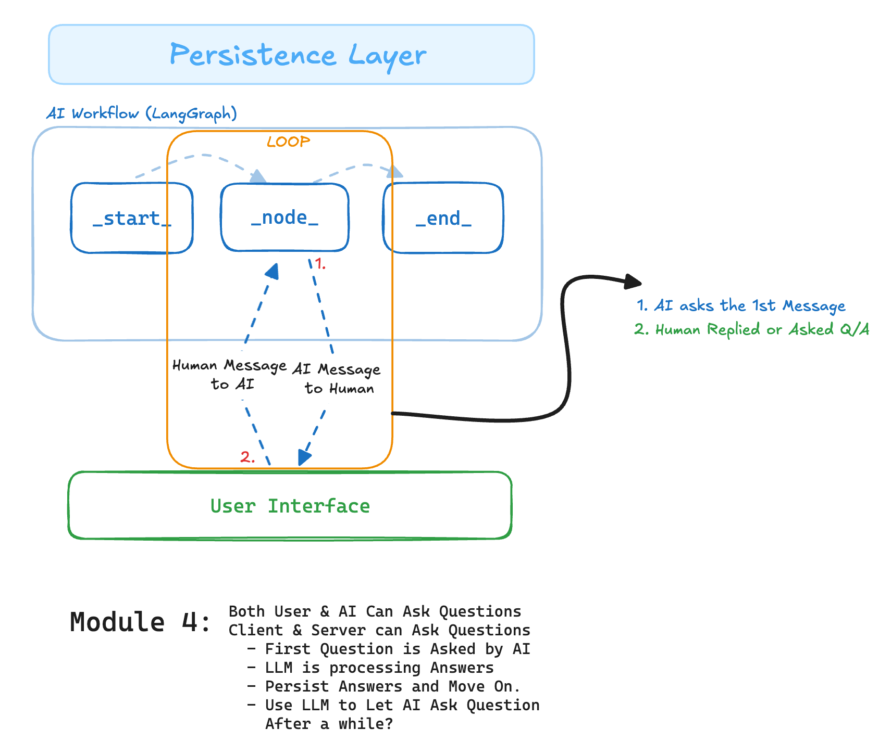
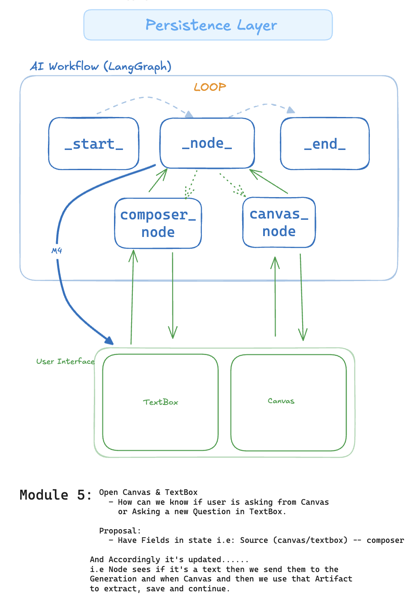

# Building Chatbots with LangGraph

We will learn to build chatbots from the following tutorial:

## Chatbot Tutorials

[Getting Started with Chatbots](https://langchain-ai.github.io/langgraph/tutorials/introduction/)

[Part 1: Build a Basic Chatbot](https://langchain-ai.github.io/langgraph/tutorials/introduction/#part-1-build-a-basic-chatbot)

[Part 2: Enhancing the Chatbot with Tools](https://langchain-ai.github.io/langgraph/tutorials/introduction/#part-2-enhancing-the-chatbot-with-tools)

[Part 3: Adding Memory to the Chatbot](https://langchain-ai.github.io/langgraph/tutorials/introduction/#part-3-adding-memory-to-the-chatbot)

[Part 4: Human-in-the-loop](https://langchain-ai.github.io/langgraph/tutorials/introduction/#part-4-human-in-the-loop)

[Part 5: Manually Updating the State](https://langchain-ai.github.io/langgraph/tutorials/introduction/#part-5-manually-updating-the-state)

[Part 6: Customizing State](https://langchain-ai.github.io/langgraph/tutorials/introduction/#part-6-customizing-state)

[Part 7: Time Travel](https://langchain-ai.github.io/langgraph/tutorials/introduction/#part-7-time-travel)

[Part 8: Learn Open Canvas](https://github.com/langchain-ai/open-canvas)

[Part 9: Using LangGraph and Graphiti](https://help.getzep.com/graphiti/graphiti/lang-graph-agent)

## Chatbot Projects

## Module 0: Build a Basic Chatbot Client UI using Open Canvas

 Build a [Open Canvas](https://github.com/langchain-ai/open-canvas) based basic web chatbot and integrate it with what you have learned in the above tutorials.

## Module 1: Sending Messages from LangGraph to Client

**Function/Class:**
To send a message from LangGraph (AI workflow) back to the client, we can use a function or class designed for message transmission. This function will handle the communication between the AI workflow and the client interface, ensuring that messages are properly formatted and delivered.

**Question and Ideation:**

- How can we ensure reliable message delivery from LangGraph to the client?
- What format should the messages be in to be compatible with the client interface?
- Try the .astream_events langchain runnable! Can we extend a function to stream  back messages using the BaseCallbackHandler/Other SEE protocols built LangChain similar to the streaming section (without langchain ChatModels) of LangGraph Documentation.

## Module 2: AI Asks Question from Human - Linear Interrupt

**Description:**
In this module, the AI asks a question from the human user in a linear fashion. This means that the AI will wait for the user's response before proceeding to the next step. This linear interrupt ensures a clear and straightforward interaction flow.

**Question and Ideation:**

- How can we design the AI to wait for user responses before proceeding?

## Module 3: AI Asks Questions from Human in a Loop - Dynamic Interrupt

**Description:**
This module allows the AI to ask questions from the human user in a loop, creating a dynamic interrupt. The AI can continue to ask questions based on the user's responses, allowing for a more interactive and adaptive conversation.

**Question and Ideation:**

- How can we implement a dynamic interrupt system for AI questions?
- What mechanisms can be used to handle user responses in a loop?

## Module 4: Both User & AI Can Ask Questions

**Description:**
In this module, both the user and the AI can ask questions. The interaction flow is as follows:

- The first question is asked by the AI.
- The LLM (Language Model) processes the answers.
- Tools/LLM are used to extract and persist the answers and move on.
- The AI can ask a question after a while, allowing for a more natural and conversational interaction.

**Question and Ideation:**

- How can we manage the flow of questions between the user and the AI?
- What tools can be used to persist answers and ensure continuity in the conversation?

## Module 5: Open Canvas & TextBox

**Description:**
This module addresses how to differentiate between user inputs from the Canvas and the TextBox. The proposal is to have fields in the state, such as `Source` (canvas/textbox) in STATE, which are updated accordingly. This allows the system to:

- Send text inputs to the generation process.
- Use the Canvas artifact to extract, save, and continue the interaction based on the context provided by the Canvas.

**Proposal:**

- Have fields in the state, such as `Source` (canvas/textbox).
- Update the state accordingly based on the input source.
- If the input is from the TextBox, send it to the generation process.
- If the input is from the Canvas, use the Canvas artifact to extract, save, and continue the interaction.

**Question and Ideation:**

- How can we effectively differentiate between inputs from the Canvas and the TextBox?
- What state management strategies can be used to handle different input sources?- Update the state accordingly based on the input source.
- If the input is from the TextBox, send it to the generation process.
- If the input is from the Canvas, use the Canvas artifact to extract, save, and continue the interaction.