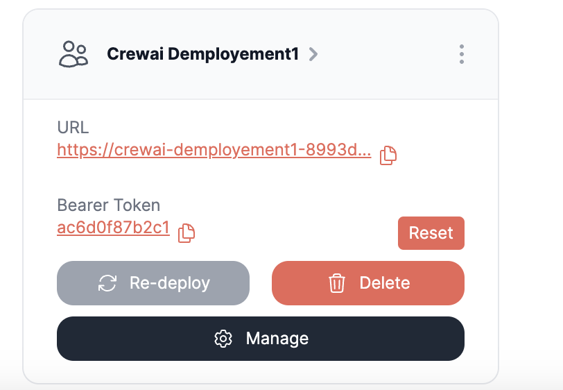

# CrewAI Deployment

This guide walks through creating a CrewAI flow locally, pushing it to GitHub, and then deploying it on the CrewAI platform.

## 1. Create a New CrewAI Flow

1. Install the CrewAI CLI if you haven’t already.
2. Run the following command to create a new flow. Replace `<project_name>` with your own project name:

   ```bash
   crewai create flow <project_name>
   ```

3. Move into the newly created directory:

   ```bash
   cd <project_name>
   ```

## 2. Modify the Flow Code

1. Open `src/<project_name>/main.py` in your editor.
2. Locate the flow function that listens to `generate_poem` and update the return statement:

   ```python
   # ...
   @listen(generate_poem)
   def save_poem(self):
       return {
           "poem": self.state.poem,
           "sentence_count": self.state.sentence_count,
           "authour": "Muhammad Qasim"
       }
   # ...
   ```

3. Save your changes.

## 3. Update the pyproject.toml

1. Open the `pyproject.toml` file in the root of your project.
2. Find the `[project.scripts]` section (or create one if missing) and ensure it has the following entries (note `poem.main:kickoff` is an example; use your module path if different):

   ```toml
   [project.scripts]
   kickoff = "poem.main:kickoff"
   run_crew = "poem.main:kickoff"
   plot = "poem.main:plot"
   ```

## 4. Create a GitHub Repository

1. Create a new GitHub repository named `crewai-demo` (or any name you prefer).
2. Push your local project to GitHub:
   ```bash
   git init
   git add .
   git commit -m "Initial commit"
   git remote add origin <your-github-repo-url>
   git push -u origin main
   ```

## 5. Login to CrewAI

1. Go to [crewai.com](https://crewai.com/) and log in with your credentials.
2. Navigate to the **Crew** tab.

## 6. Deploy from GitHub

1. In the **Crew** tab, click **Deploy your crews from GitHub**.
2. Select the repository you just created, for example `crewai-demo`.
3. Choose the **main** branch (or whichever branch you want to deploy).
4. Add any **Environment Variables** your flow requires. For example:
   ```
   GEMINI_API_KEY=<paste gemini keys here>
   MODEL=gemini/gemini-2.0-flash
   ```
5. Click **Deploy** and wait 1 to 10 minutes for the deployment to complete.



## 7. Verify Your Deployment

- After the deployment succeeds, you will see a **URL** and a **Bearer Token** for your new service.
- You can open `<deployment_url>/docs` in your browser to view auto-generated documentation and test your endpoints.
- Use the **Bearer Token** to authenticate when calling your flow’s endpoints.

## 8. Usage Example

- Once deployed, you can test your flow with a request to the endpoint, for example:

  ```bash
  curl -X POST "<deployment_url>/generate_poem" \
       -H "Authorization: Bearer <your_bearer_token>" \
       -H "Content-Type: application/json" \
       -d '{"prompt": "Write a short poem about the sunrise."}'
  ```

- You should receive a JSON response containing your poem and additional data as specified in the `save_poem` function.

---

**That’s it!** You’ve successfully created and deployed a CrewAI flow from GitHub. If you have any issues or questions, refer to the official [CrewAI documentation](https://crewai.com/docs) or open an issue in your repository.

## Video Tutorial

Watch this video tutorial for a detailed walkthrough of the deployment process:

[](https://www.youtube.com/watch?v=ubIUHudIeIs)
