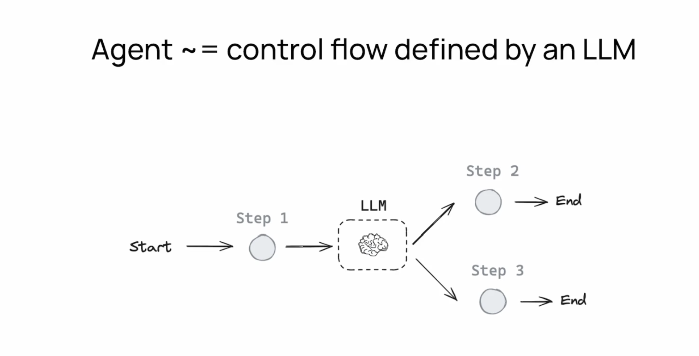
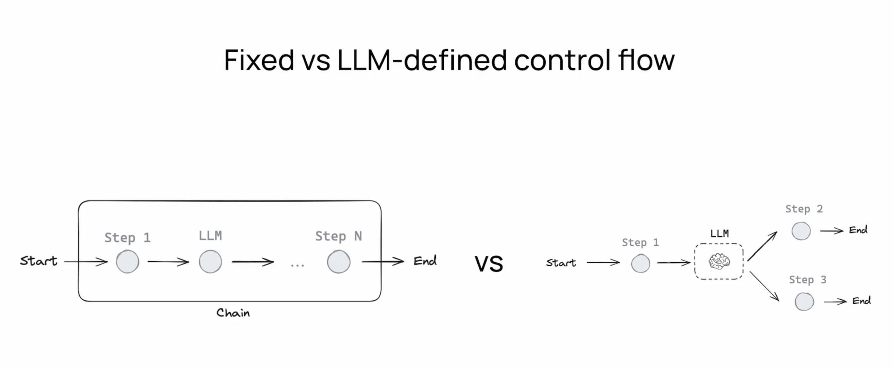
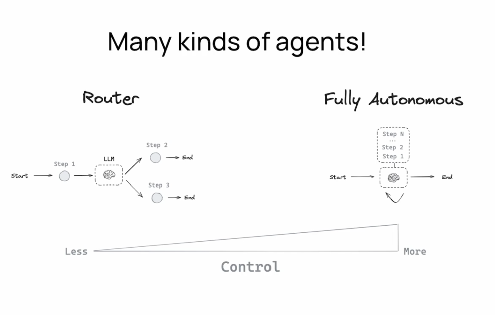
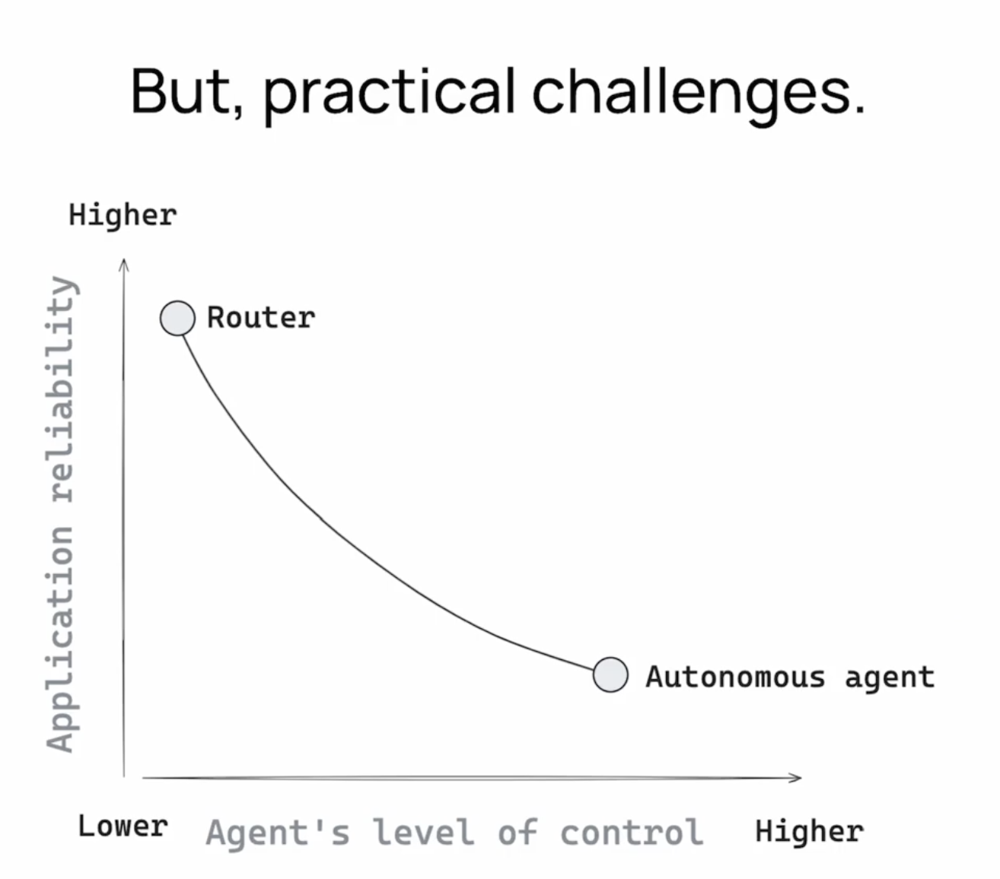
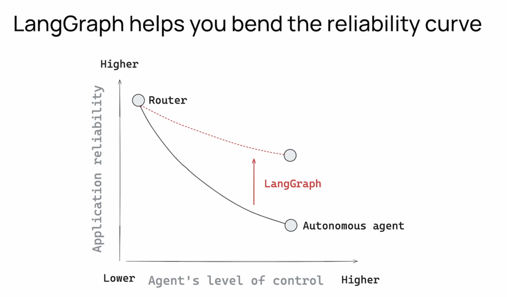
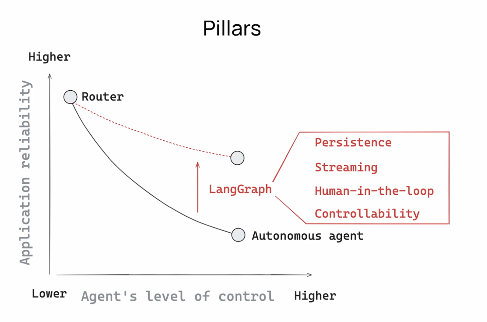

# AI Agents and LangGraph

[Report: What Are AI Agents?](https://www.oreilly.com/library/view/what-are-ai/9781098159726/)

[Watch: What is AI Agent? | Simple Explanation of an AI Agent](https://www.youtube.com/watch?v=2-JV8UxegWE)Thi

[What are AI Agents? By AWS](https://aws.amazon.com/what-is/ai-agents/)

[What are AI agents? By IBM](https://www.ibm.com/think/topics/ai-agents)

[Let’s Get Agentic: LangChain and LlamaIndex Talk AI Agents](https://thenewstack.io/lets-get-agentic-langchain-and-llamaindex-talk-ai-agents/)

[What are AI agents? By Harrison Chase CEO LangChain](https://blog.langchain.dev/what-is-an-agent/)

[Not an AI Agent, Agentic Systems, Autonomous AI Agents](https://x.com/AndrewYNg/status/1801295202788983136)

AI agents are software programs that can autonomously perform tasks on behalf of users or other systems. They interact with their environment, collect data, and use that data to make decisions and take actions to achieve specific goals¹². These agents can be used in various applications, from customer service chatbots to complex data analysis tools.

## Langraph Balances Reliability with Control**

LangGraph is indeed a good tool for developing AI agents, especially research agents. It integrates seamlessly with LangChain V3, allowing developers to create sophisticated agents capable of delivering detailed, multi-step responses by leveraging multiple information sources⁴⁵. LangGraph's graph-based approach offers greater flexibility, transparency, and customizability compared to traditional frameworks⁴.
Source: Conversation with Copilot, 9/17/2024

In LangChain, the term **"Graph"** in LangGraph refers to a structured way of organizing and connecting various components, such as agents, tools, and chains, in a graph-like manner. Here's why it's called a "Graph":

**(1) Graph Representation:** The term "Graph" is used because the architecture resembles a graph structure, where nodes represent different components (like tasks, agents, or tools) and edges represent the flow of data or control between them. This structure allows for complex workflows and dependencies to be visually and programmatically represented as a graph.

**(2) Flexible Connections:** Using a graph allows for highly flexible connections between components. For example, an output from one node can be directed as an input to multiple other nodes, allowing for branching, looping, and other sophisticated logic that would be cumbersome to express in linear workflows.

**(3) Dynamic and Adaptive Workflows:** The graph-based approach is particularly suited for dynamic and adaptive workflows, which are common in AI and ML systems where decisions need to be made based on the results of previous steps. This makes it easier to design and execute complex workflows that can adapt based on intermediate outcomes.

**(4) Visual Representation and Debugging:** A graph representation makes it easier to visualize and debug workflows since you can clearly see how data flows between different components. This visual clarity is crucial when dealing with intricate systems involving multiple agents and tools.

**(5) Scalability and Modularity:** Graph structures support scalability by allowing new nodes and connections to be added without restructuring the entire system. It also promotes modularity, enabling the reuse of components in different contexts.

(1) What Are AI Agents? - IBM. https://www.ibm.com/think/topics/ai-agents.
(2) What are AI Agents?- Agents in Artificial Intelligence Explained - AWS. https://aws.amazon.com/what-is/ai-agents/.
(3) Using LangGraph to build better AI Agents - Geeky Gadgets. https://www.geeky-gadgets.com/using-langgraph-to-build-ai-agents/.
(4) Building Local AI Agents: A Guide to LangGraph, AI Agents, and Ollama. https://blog.paperspace.com/building-local-ai-agents-a-guide-to-langgraph-ai-agents-and-ollama/.
(5) What are AI agents? A comprehensive guide - Zapier. https://zapier.com/blog/ai-agent/.
(6) A Practical Guide to Building AI Agents With LangGraph. https://adasci.org/a-practical-guide-to-building-ai-agents-with-langgraph/.

## The Modern History of AI Agents

The modern history of AI agents has seen rapid advancements, particularly with the development of large language models (LLMs) and frameworks designed to enhance their capabilities. Here's an overview leading up to the OpenAI Assistant API, AutoGen, CrewAI, and LangGraph:

### 2010s: The Rise of Deep Learning and LLMs
- **Deep Learning**: The 2010s marked the rise of deep learning, significantly improving AI models' performance in various tasks, including image recognition and natural language processing (NLP).
- **Large Language Models**: Models like OpenAI's GPT-2 and GPT-3 demonstrated the potential of LLMs to generate human-like text, paving the way for more sophisticated AI agents.

### Early 2020s: Emergence of Advanced AI Agents
- **Conversational Agents**: The success of LLMs led to the development of conversational agents, such as chatbots and virtual assistants, capable of understanding and generating natural language.
- **OpenAI Assistant API**: OpenAI introduced the Assistant API, allowing developers to integrate powerful language models into their applications, enabling more interactive and intelligent AI agents¹.

### Mid 2020s: Advancements in AI Agent Frameworks
- **AutoGen**: AutoGen specializes in conversational agents, providing a high-level abstraction over multi-agent collaboration. It leverages the OpenAI Assistant API to enhance agents with advanced capabilities, such as code interpretation and file access².
- **CrewAI**: CrewAI combines AutoGen’s autonomy with a structured, role-playing approach, facilitating sophisticated agent interactions. It balances autonomy with structured processes, making it ideal for both development and production phases¹.
- **LangChain and LangGraph**: LangChain introduced LangGraph, a framework designed to build and manage AI agents using graph-based workflows. LangGraph allows for highly controllable and low-level interactions, making it ideal for complex, multi-step processes¹.

### Key Features of Modern AI Agent Frameworks and LangGraph
- **Controlled Flow**: Frameworks like LangGraph enable developers to define a clear flow of execution, creating state machines where LLMs act as reasoning engines.
- **Human-in-the-Loop**: These frameworks like LangGraph support human-in-the-loop interactions, ensuring that AI agents can be guided and corrected by human operators when necessary¹.
- **Production-Ready**: Designed for production environments, these frameworks provide the reliability and control needed for real-world applications. LangGraph is production ready.

These advancements represent a significant evolution in the field of AI agents, offering powerful tools for building sophisticated and reliable AI-driven applications. 

Source: Conversation with Copilot, 9/17/2024
(1) An Overview of Multi Agent Frameworks: Autogen, CrewAI and LangGraph. https://sajalsharma.com/posts/overview-multi-agent-fameworks/.
(2) Agent Backed by OpenAI Assistant API | AutoGen - GitHub Pages. https://microsoft.github.io/autogen/docs/topics/openai-assistant/gpt_assistant_agent/.
(3) The History of OpenAI: Sam Altman Pioneering AI Without Musk. https://www.business2community.com/statistics-pages/history-of-openai.
(4) Announcing Azure OpenAI Service Assistants Preview Refresh. https://techcommunity.microsoft.com/t5/ai-azure-ai-services-blog/announcing-azure-openai-service-assistants-public-preview/ba-p/4143217.

## The LangChain Academy Course to Learn from

https://academy.langchain.com/courses/intro-to-langgraph

The LangGraph learning notebooks are in course-notebooks directory

## Other Courses and Resources

## Deep Learning Course

[AI Agents in LangGraph](https://www.deeplearning.ai/short-courses/ai-agents-in-langgraph/)

## References:

[LangGraph 101: it's better than LangChain](https://www.youtube.com/watch?v=qaWOwbFw3cs)

[Introduction to LangGraph](https://langchain-ai.github.io/langgraph/tutorials/introduction/#part-1-build-a-basic-chatbot)

[Deep Dive into LangGraph: Building Stateful and Multi-Agent Language Models](https://blog.gopenai.com/deep-dive-into-langgraph-building-stateful-and-multi-agent-language-models-b92d75ebe6ba)

[Conceptual Guides](https://langchain-ai.github.io/langgraph/concepts/)

[How-To Guides](https://langchain-ai.github.io/langgraph/how-tos/)

[Build an AI Coding Agent with LangGraph by LangChain](https://www.analyticsvidhya.com/blog/2024/03/build-an-ai-coding-agent-with-langgraph-by-langchain/)

## LangGraph Framework

LangGraph is a framework designed for building stateful, multi-actor applications using large language models (LLMs). It is part of the LangChain ecosystem and offers several unique features that make it stand out from other agentic frameworks.

### Key Features of LangGraph

1. **State Management**: LangGraph excels in automatic state management, which allows it to track and persist information across multiple interactions. This ensures that the system maintains context and responds appropriately to new inputs⁶.

2. **Graph Structure**: LangGraph uses a directed graph structure where each node represents an LLM agent, and the edges are the communication channels between these agents. This structure allows for clear and manageable workflows⁶.

3. **Coordination**: LangGraph ensures that agents execute in the correct order and that necessary information is exchanged seamlessly. This is crucial for complex applications where multiple agents need to work together to achieve a common goal⁶.

4. **Cycles and Controllability**: LangGraph supports cyclical graphs, which are essential for developing sophisticated agent runtimes. It also offers granular control over the agent's thought process, enabling developers to make data-driven decisions⁷.

5. **Human-Agent Collaboration**: LangGraph is designed for seamless collaboration between agents and humans. It allows agents to write drafts for review and await approval before acting, making it easier to inspect and modify the agent’s actions³.

6. **Scalability**: With LangGraph Cloud, you can quickly deploy and scale your applications. It includes infrastructure for prototyping, debugging, and sharing LangGraph applications³.

### How LangGraph is Superior to Other Agentic Frameworks

1. **Expressiveness**: LangGraph provides a more expressive framework to handle unique tasks without restricting users to a single black-box cognitive architecture. This makes it suitable for complex, bespoke tasks³.

2. **Reliability**: LangGraph includes easy-to-add moderation and quality loops that prevent agents from veering off course. This ensures that the agents are reliable and perform tasks accurately³.

3. **Ease of Use**: LangGraph abstracts away the complexities associated with state management and agent coordination, simplifying the development process. This allows developers to focus on the high-level logic of their applications⁶.

4. **Advanced Control**: LangGraph offers advanced control features like "time-travel," which allows developers to take different actions at specific times. This level of control is not commonly found in other frameworks³.

5. **Iterative Development**: LangGraph supports iterative, decision-based flows, which are often required for advanced AI agentic frameworks. This makes it easier to build and improve complex applications over time⁵.

LangGraph's combination of state management, coordination, and advanced control features makes it a powerful tool for developing sophisticated, reliable, and scalable AI applications.

If you have any specific questions or need further details, feel free to ask!

Source: Conversation with Copilot, 9/17/2024
(1) LangGraph Tutorial: What Is LangGraph and How to Use It?. https://www.datacamp.com/tutorial/langgraph-tutorial.
(2) langgraph · PyPI. https://pypi.org/project/langgraph/.
(3) LangGraph - LangChain. https://www.langchain.com/langgraph.
(4) Decode How to Build Agentic AI Applications using LangGraph. https://datasciencedojo.com/newsletter/agentic_ai_langgraph/.
(5) Mastering Agents: LangGraph Vs Autogen Vs Crew AI - Galileo. https://www.rungalileo.io/blog/mastering-agents-langgraph-vs-autogen-vs-crew.
(6) An Overview of Multi Agent Frameworks: Autogen, CrewAI and LangGraph. https://sajalsharma.com/posts/overview-multi-agent-fameworks/.
(7) langchain-ai/langgraph: Build resilient language agents as graphs. - GitHub. https://github.com/langchain-ai/langgraph.

## Reading Material

[GenAI Agents: Comprehensive Repository for Development and Implementation](https://github.com/NirDiamant/GenAI_Agents)